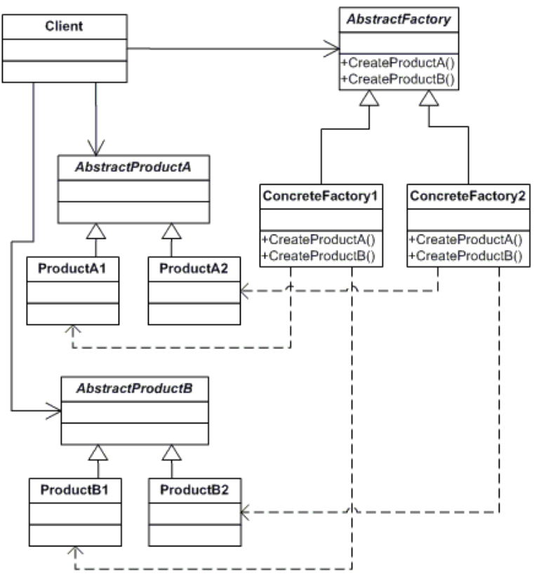
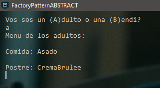
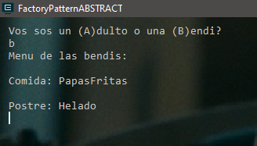

# PATRON FACTORY ABSTRACT 

Abstract Factory Pattern es un patrón de creación en el que se definen interfaces para crear familias de objetos relacionados sin especificar sus implementaciones reales.

Al utilizar este patrón, podemos usar "factories" que devuelven muchos tipos de objetos relacionados. 

Este patrón permite arquitecturas más grandes como la <a href="https://docs.microsoft.com/en-us/dotnet/core/extensions/dependency-injection" target="_blank">inyección de dependencia</a> :link:.

| Tipo       | Utilidad   | Bueno para                                                                                |
|:----------:|:----------:|:-----------------------------------------------------------------------------------------:|
| Creacional | 5 / 5      | Crear objetos de DIFERENTES FAMILIAS sin tener que "depender" de implementaciones en concreto |

## Los participantes de este patrón



* **AbstractFactory** declara una interfaz para operaciones que crearán objetos **AbstractProduct**.
* Los objetos **ConcreteFactory** implementan las operaciones definidas por **AbstractFactory**.
* **AbstractProduct** declara una interfaz para un tipo de producto.
* Los Productos definen un objeto de producto que será creado por la **ConcreteFactory** correspondiente.
* El Cliente utiliza las interfaces **AbstractFactory** y **AbstractProduct**.


## Ejemplo

En un caso anterior, cuando vimos el patrón Factory utilizamos el ejemplo de sandwichs, donde no importa de que estén hechos básicamente todo el 'conjunto' termina siempre entre dos rebanadas de pan, desde esa perspectiva podríamos decir que los sándwiches son una familia de objetos relacionados... pero que sucede en el caso QUE TENGAMOS LA NECESIDAD DE TENER QUE MODELAR VARIAS FAMILIAS DE OBJETOS, en donde, cada familia tiene características distintas en su gran mayoria y quizas comparte algo generico con el resto pero no es el factor determinante en la creacion del objeto?

Acá es en donde tenemos que volvernos mas generalistas y modelar "sets" de recetas para poder abstraernos mas con el concepto que queremos diagramar.

Con esa premisa entonces si tenemos como punto de partida los sandwichs, digamos que son una comida pero que a la vez pueden formar parte de algun combo o tipo especial de menú, quizás algunas preparaciones puedan ser para adultos, infantiles, veganos, etc, lo mismo sucede con los postres, según ciertos gustos o requerimientos del negocio pueden estar agrupados por algún factor por ejemplo precios, tiempo de preparación entre otros.

1. Entonces, a nivel general separemos entre PlatoPrincipal y Postres para sectorizar cierto tipo de preparaciones de manera "genérica"...estos serian los PRODUCTOS ABSTRACTOS , creo una biblioteca de clases como primer paso y dentro genero los Prods Abstractos:

```csharp
/// <summary>
/// Un producto abstracto
/// </summary>
abstract class PlatoPrincipal { }
/// <summary>
/// Un producto abstracto
/// </summary>
abstract class Postre { }
```
2. Después tengo que usar "algo" que me devuelva un PlatoPrincipal o Postre segun sea necesario y ahi es en donde uso ABSTRACT FACTORY de la siguiente manera:
```csharp
/// <summary>
/// La clase ABSTRACTA FACTORY, la cual define los metodos para crear OBJETOS ABSTRACTOS
/// </summary>
abstract class RecetaFactory
{
    public abstract PlatoPrincipal CrearPlatoPrincipal();
    public abstract Postre CrearPostre();
}
```
3. Ahora ya puedo empezar a implementar los objetos actuales *(PlatoPrincipal - Postre)* y esa implementación es posible mediante el uso de CONCRETE PRODUCT...yes! algo concreto!:

```csharp
/// <summary>
/// Producto en concreto
/// </summary>
class Milanesa : PlatoPrincipal { } 

/// <summary>
/// Producto en concreto
/// </summary>
class PapasFritas : PlatoPrincipal { }

/// <summary>
/// Producto en concreto
/// </summary>
class Torta : Postre { }

/// <summary>
/// Producto en concreto
/// </summary>
class Helado : Postre { }
```
4. De la misma manera que tengo *PRODUCTOS CONCRETOS* también me hace falta UN **CONCRET FACTORY**...sino de que sirve especificar el producto sin asignar quien va a procesarlo/realizarlo/etc y para eso tenemos que implementar el ABSTRACT FACTORY y devolver las recetas o preparaciones que les hayamos asignado por ejemplo ComidaAdultos y ComidaMenores :
```csharp
/// <summary>
/// Un FACTORY CONCRETO que CREA OBJETOS CONCRETOS mediante la implementacion de metodos ABSTRACTOS FACTORY.
/// </summary>
class ComidaAdultosFactory : RecetaFactory
{
    public override PlatoPrincipal CrearPlatoPrincipal()
    {
        return new Asado();
    }

    public override Postre CrearPostre()
    {
        return new CremaBrulee();
    }
}

class ComidaParaLasBendis : RecetaFactory
{
    public override PlatoPrincipal CrearPlatoPrincipal()
    {
        return new PapasFritas();
    }

    public override Postre CrearPostre()
    {
        return new Helado();
    }
}
```

5. Ahora vemos como usamos todo esto!...hasta aquí lo mas lógico es preguntar antes de comenzar el ciclo si es un **(A)**DULTO o un **(M)**ENOR sobre el cual queremos ver que opciones de servicio tiene y mostrar el menu correspondiente, entonces en el entry point de la aplicación hacemos algo similar:

```csharp
using System;
using System.Collections.Generic;
using System.Linq;
using System.Text;
using System.Threading.Tasks;

namespace FactoryPatternABSTRACT
{
    class Program
    {
        static void Main(string[] args)
        {
            Console.WriteLine("Vos sos un (A)dulto o una (B)endi?");
            char opc    = Console.ReadKey().KeyChar;
            char opcion = char.ToUpper(opc);

            RecetaFactory factory;

            switch(opcion)
            {
                case 'A':
                    factory = new ComidaAdultosFactory();
                    Console.WriteLine("\nMenu de los adultos: ");
                    break;
                case 'B':
                    factory = new ComidaParaLasBendis();
                    Console.WriteLine("\nMenu de las bendis: ");
                    break;

                default:
                    throw new NotImplementedException();
            }

            var comida = factory.CrearPlatoPrincipal();
            var postre = factory.CrearPostre();

            Console.WriteLine("\nComida: " + comida.GetType().Name);
            Console.WriteLine("\nPostre: " + postre.GetType().Name);

            Console.ReadKey();
        }
    }
}
```
6. Nos queda algo similar:




## Voy a usar alguna vez este patrón? :unamused:
Absolutamente :smiley: Incuestionablemente. Abstract Factory es un patrón extremadamente común y, como se mencionó anteriormente, habilita arquitecturas como Dependency Injection. Dicho esto, también es uno de los patrones propensos al uso excesivo: es fácil comenzar a usar Abstract Factories en cualquier momento que necesites crear objetos. Tengamos en cuenta cuándo decidimos utilizar este patrón y asegúrarnos de que realmente lo necesitamos.

Abstract Factory nos permite entonces definir de forma genérica familias de objetos relacionados, dejando el uso real para que esos objetos se implementen según sea necesario.


